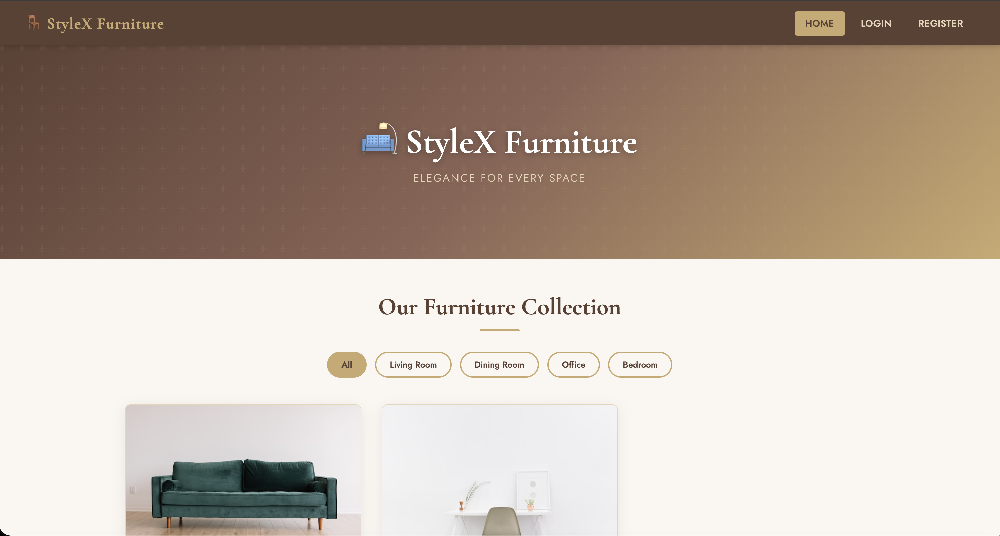

# 🛋️ Furniture Store

A web application for browsing and ordering furniture online.

## 📌 Features

- User registration and login
- Browse furniture products
- View product details
- Shopping cart
- Place orders
- Admin dashboard

## 🛠️ Technologies

- PHP
- MySQL
- HTML
- CSS

## 🚀 How to Run

1. Install XAMPP.
2. Copy the project folder to `htdocs`.
3. Import `furniture_store.sql` into phpMyAdmin.
4. Start Apache and MySQL.
5. Open the project in your browser.

## 📷 Screenshots

### Home Page

### Products

### Item Details

### Shopping Cart

### Admin Dashboard

## 👩‍💻 Author

Raghad